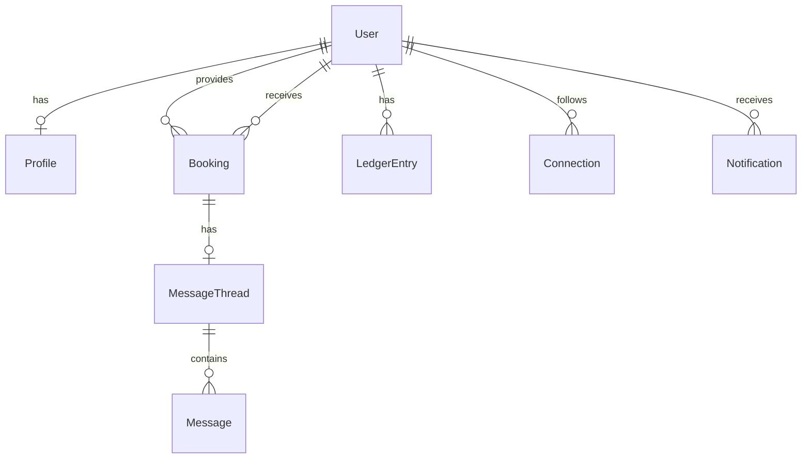

# 🌟 TimeBank - Time-Based Currency Exchange Platform

> **Where time becomes currency. Exchange your skills, earn credits, and build a cosmic community.**

[](https://nextjs.org/)
[](https://nodejs.org/)
[](https://postgresql.org/)
[](https://typescriptlang.org/)

## 🚀 Quick Start

```bash
# Clone and install
git clone <repository-url>
cd TimeBank
npm install

# Start development servers
npm run dev
```

**Access the application:**
- Frontend: http://localhost:3000
- Backend API: http://localhost:4000

## ✨ Features

### 🎯 Core Functionality
- **Time Exchange**: Earn credits by helping others, spend credits for services
- **Profile Directory**: Browse and connect with skilled individuals
- **Booking System**: Request, accept, and complete time sessions
- **Ledger System**: Track earnings and spending with atomic transactions
- **Messaging**: Lightweight chat for each booking
- **Connections**: Follow and build your network

### 🎨 Cosmic Design
- **Stunning UI**: Glassmorphism with cosmic animations
- **Responsive**: Mobile-first design approach
- **Accessibility**: Keyboard navigation and focus management
- **Performance**: Optimized animations and lazy loading

## 🏗️ Architecture

### Backend (Node.js + Express + Prisma)
```
├── Authentication (JWT + bcrypt)
├── Profile Management
├── Booking System
├── Ledger & Transactions
├── Messaging System
└── Database (PostgreSQL)
```

### Frontend (Next.js 14 + React 18)
```
├── Landing Page (Cosmic Hero)
├── Authentication (Login/Signup)
├── Dashboard (Balance & Activity)
├── Directory (Profile Search)
├── Profile Management
├── Booking Requests
└── History & Notifications
```

## 🛠️ Tech Stack

| Category | Technology |
|----------|------------|
| **Frontend** | Next.js 14, React 18, TypeScript, TailwindCSS |
| **Backend** | Node.js, Express.js, TypeScript, Prisma ORM |
| **Database** | PostgreSQL |
| **Authentication** | JWT, bcrypt |
| **Styling** | TailwindCSS, Custom CSS Animations |
| **Icons** | Lucide React |

## 📊 Database Schema



## 🎯 Key Features

### 🔐 Authentication System
- Secure JWT-based authentication
- Password hashing with bcrypt
- Session management
- Protected routes

### 💰 Time Currency System
- **Earn Credits**: Help others and earn time credits
- **Spend Credits**: Use credits to receive services
- **Balance Tracking**: Real-time balance calculation
- **Transaction History**: Complete audit trail

### 🤝 Community Features
- **Profile Directory**: Search and filter users
- **Skill Matching**: Find people with specific skills
- **Connection System**: Follow and build networks
- **Rating System**: Build reputation through quality service

### 📱 User Experience
- **Cosmic Theme**: Stunning space-themed design
- **Responsive Design**: Works on all devices
- **Smooth Animations**: Engaging user interactions
- **Intuitive Navigation**: Easy-to-use interface

## 🚀 Getting Started

### Prerequisites
- Node.js 20+
- PostgreSQL 16+
- npm or yarn

### Installation

1. **Clone the repository**
   ```bash
   git clone <repository-url>
   cd TimeBank
   ```

2. **Install dependencies**
   ```bash
   npm install
   ```

3. **Set up environment variables**
   ```bash
   # Backend
   cp backend/env.example backend/.env
   # Edit backend/.env with your PostgreSQL credentials
   
   # Frontend
   cp frontend/env.example frontend/.env.local
   # Edit frontend/.env.local with your API URL
   ```

4. **Set up the database**
   ```bash
   cd backend
   npx prisma generate
   npx prisma migrate dev --name init_timebank_pg
   ```

5. **Start the development servers**
   ```bash
   # From root directory
   npm run dev
   ```

## 📁 Project Structure

```
TimeBank/
├── backend/                 # Node.js + Express API
│   ├── src/
│   │   ├── routes/         # API endpoints
│   │   ├── middleware/     # Authentication
│   │   └── lib/           # Database connection
│   ├── prisma/            # Database schema
│   └── package.json
├── frontend/               # Next.js React app
│   ├── src/app/
│   │   ├── components/    # Reusable components
│   │   ├── dashboard/     # Dashboard pages
│   │   ├── directory/     # Profile directory
│   │   └── profile/       # User profiles
│   └── package.json
├── package.json           # Root package with scripts
├── setup.md              # Detailed setup guide
└── INTERVIEW_DOCUMENTATION.md # Interview documentation
```

## 🎨 Design System

### Color Palette
- **Primary**: Golden cosmic gradients (#fbbf24 → #92400e)
- **Background**: Deep slate (#0f172a, #1e293b)
- **Accents**: Amber and orange tones
- **Text**: Slate with cosmic glow effects

### Typography
- **Headings**: Orbitron (futuristic, cosmic)
- **Body**: Inter (clean, readable)
- **Effects**: Gradient text with glow shadows

### Components
- **Glassmorphism Cards**: Translucent panels with backdrop blur
- **Cosmic Buttons**: Gradient backgrounds with hover effects
- **Floating Animations**: Gentle orbit and drift effects
- **Interactive Elements**: Hover glows and cosmic transitions

## 🔧 API Endpoints

### Authentication
- `POST /auth/signup` - Create account
- `POST /auth/login` - Sign in
- `GET /auth/me` - Get current user

### Profiles
- `GET /profiles` - List profiles with filters
- `GET /profiles/:id` - Get specific profile

### Bookings
- `POST /booking` - Create time request
- `GET /booking` - List user's bookings
- `PATCH /booking/:id/accept` - Accept request
- `PATCH /booking/:id/decline` - Decline request
- `POST /booking/:id/complete-confirm` - Complete session

### Wallet
- `GET /wallet/balance` - Get current balance
- `GET /wallet/history` - Get transaction history

## 🎯 Demo Flow

1. **Landing Page**: Cosmic hero with feature showcase
2. **Sign Up**: Create account with profile setup
3. **Dashboard**: View balance and pending requests
4. **Directory**: Browse and search profiles
5. **Request Time**: Send time requests to other users
6. **Complete Sessions**: Earn and spend time credits

## 🚀 Deployment

### Production Build
```bash
npm run build
npm start
```

### Docker (Optional)
```bash
docker-compose up -d
```

## 🤝 Contributing

1. Fork the repository
2. Create a feature branch
3. Make your changes
4. Test thoroughly
5. Submit a pull request

## 📄 License

This project is licensed under the MIT License.

## 🎯 Interview Ready

This project demonstrates:
- **Full-Stack Development**: End-to-end application
- **Modern Technologies**: Latest frameworks and tools
- **Database Design**: Complex relationships and transactions
- **UI/UX Design**: Creative and engaging interface
- **Security**: Proper authentication and validation
- **Performance**: Optimized queries and rendering

Perfect for showcasing technical expertise in interviews! 🚀

---

**Built with ❤️ and cosmic energy** ⭐

*TimeBank - Where every hour has value, every skill matters, and every connection counts.*
